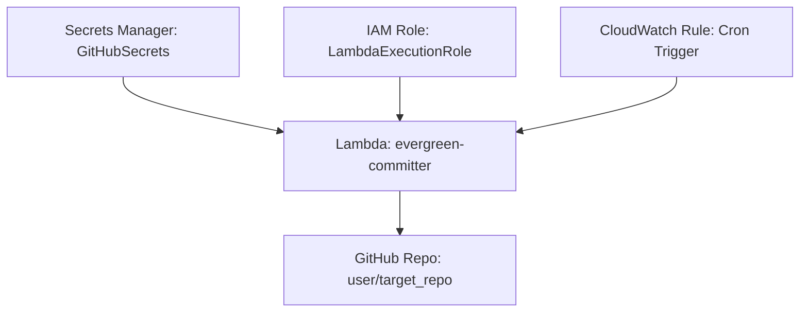

# Evergreen

Keep that git contribution chart evergreen

A Lambda function that makes meaningless GitHub commits to keep your contribution graph green 🌱


## Setup

### 1. Requirements

- Create a new, private personal repository. This will be the repo Evergreen pushes commits to.
- Create a [GitHub Personal Access Token (PAT)](https://docs.github.com/en/authentication/keeping-your-account-and-data-secure/managing-your-personal-access-tokens)
  - Your GitHub PAT needs `repo` scope.

### 2. Deploy with AWS CDK

1. Install the AWS CDK CLI:
    ```sh
    npm install -g aws-cdk
    ```

2. Set environment variables for your GitHub credentials:
    ```sh
    export REPO_URL="https://github.com/your_user/your_repo.git"
    export GITHUB_USERNAME="your_user"
    export GITHUB_TOKEN="your_pat"
    export GITHUB_EMAIL="your_email@example.com"
    export LAMBDA_CRON="cron(0 12 * * ? *)" # Optional: Set the cron expression for the Lambda trigger
    ```

3. Deploy the stack:
    ```sh
    cdk deploy
    ```


## Project Structure

```
.gitignore
app.py
cdk.context.json
cdk.json
evergreen_stack.py
README.md
requirements-dev.txt
lambda/
    commit_bot.py
    Dockerfile
    requirements.txt
```

### Files and Directories

- `app.py`: Entry point for the AWS CDK application.
- `evergreen_stack.py`: Defines the AWS CDK stack for the Evergreen Lambda function.
- `lambda/`: Contains the Lambda function code and Dockerfile.
  - `commit_bot.py`: The Lambda function that makes GitHub commits.
  - `Dockerfile`: Dockerfile for the Lambda function.
  - `requirements.txt`: Python dependencies for the Lambda function.
- `cdk.json`: Configuration file for the AWS CDK.
- `requirements-dev.txt`: Development dependencies for the AWS CDK.
- `.gitignore`: Git ignore file.

## License

This project is licensed under the MIT License.
